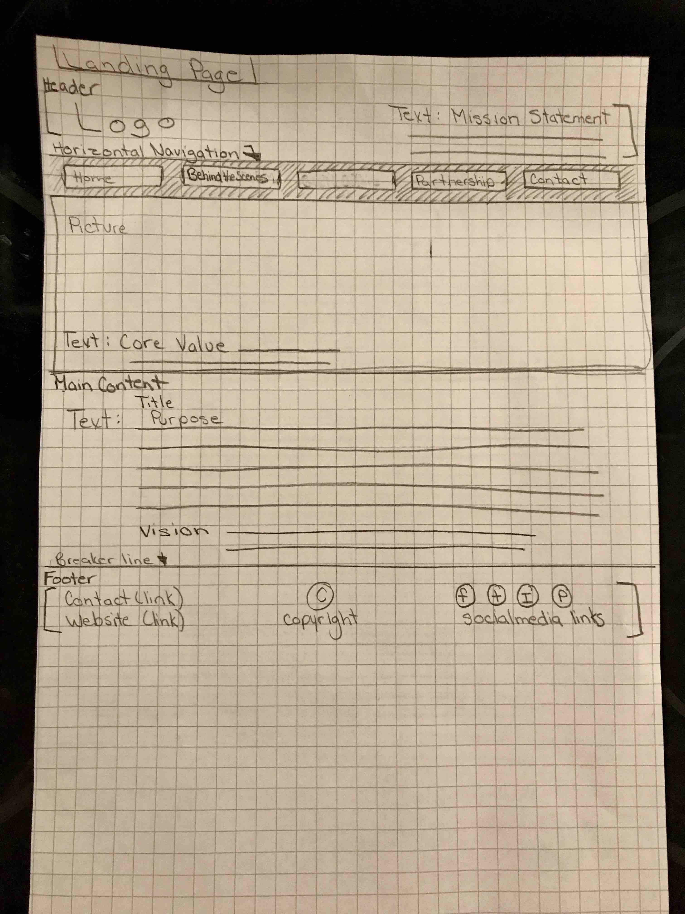
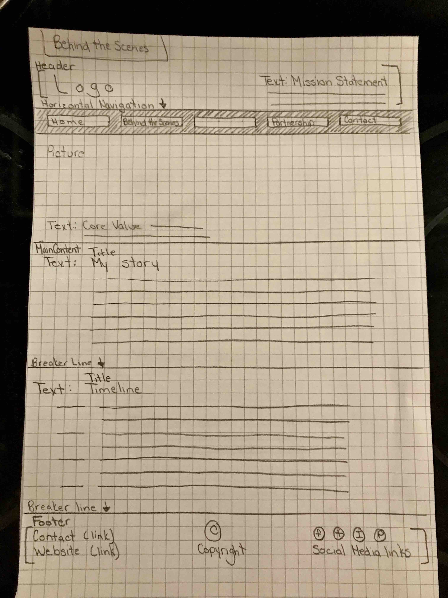
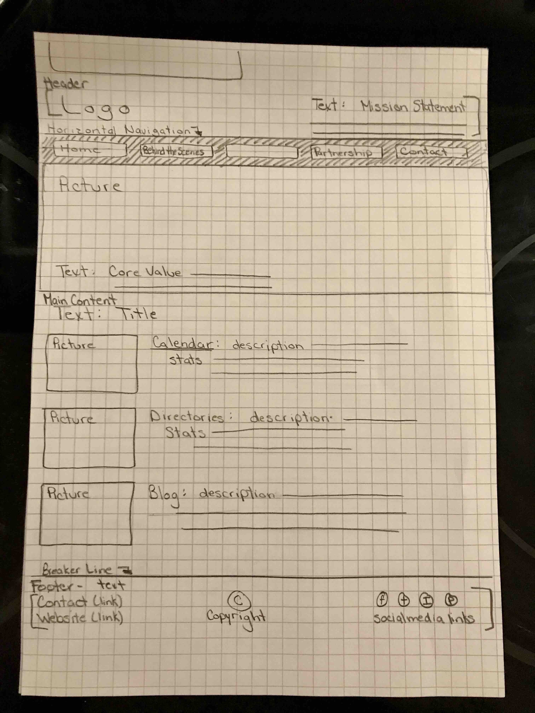
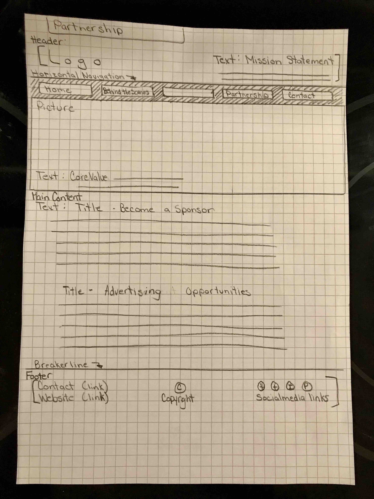

# My INF 7420 Project

I am going to build a business portfolio site for Great Lakes Bay Parents.  The main purpose of the project is to showcase my website to potential sponsors and businesses who are interested in advertising.

## Wireframes
Planning is necessary in order to achieve success, so here are some wireframes to show how the site architecture and layout could possibly be.

Header – will include website logo, mission statement, and navigation menu

Navigation Menu – will include links to other pages like Landing Page, Behind the Scenes,not named, Partnership, and Contact

Main Content – will include images and text discussing the websites purpose and vision

Footer – will include copyright information, website link, contact link, and social media links

Header – will include website logo, mission statement, and navigation menu

Navigation Menu – will include links to other pages like Landing Page, Behind the Scenes,not named, Partnership, and Contact

Main Content – will include images and text that will tell "My Story" and include the business timeline

Footer – will include copyright information, website link, contact link, and social media links

Header – will include website logo, mission statement, and navigation menu

Navigation Menu – will include links to other pages like Landing Page, Behind the Scenes,not named, Partnership, and Contact

Main Content - will include images and text of descriptions of what GLBM offer, along with statistics

Footer – will include copyright information, website link, contact link, and social media links

Header – will include website logo, mission statement, and navigation menu

Navigation Menu – will include links to other pages like Landing Page, Behind the Scenes,not named, Partnership, and Contact

Main Content – will include images and text on partnership and advertising opportunities

Footer – will include copyright information, website link, contact link, and social media links

Header – will include website logo, mission statement, and navigation menu

Navigation Menu – will include links to other pages like Landing Page, Behind the Scenes,not named, Partnership, and Contact

Main Content – will include images and Contact form

Footer – will include copyright information, website link, contact link, and social media links
